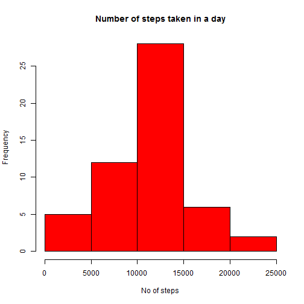
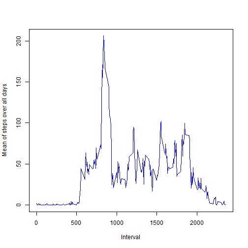
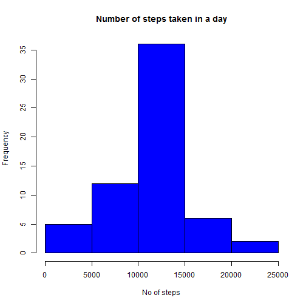
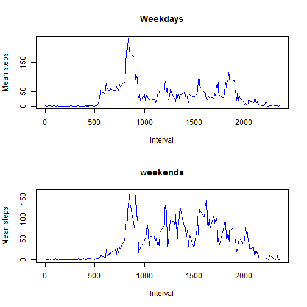

# Basic Analysis of 'Activty monitoring devices' Data

## Loading and preprocessing the data

We will load the csv file containing activity data into variable 'dat' and look at summarised content


```r
dat <- read.csv("activity.csv")
summary(dat)
```

```
##      steps                date          interval     
##  Min.   :  0.00   2012-10-01:  288   Min.   :   0.0  
##  1st Qu.:  0.00   2012-10-02:  288   1st Qu.: 588.8  
##  Median :  0.00   2012-10-03:  288   Median :1177.5  
##  Mean   : 37.38   2012-10-04:  288   Mean   :1177.5  
##  3rd Qu.: 12.00   2012-10-05:  288   3rd Qu.:1766.2  
##  Max.   :806.00   2012-10-06:  288   Max.   :2355.0  
##  NA's   :2304     (Other)   :15840
```

```r
str(dat)
```

```
## 'data.frame':	17568 obs. of  3 variables:
##  $ steps   : int  NA NA NA NA NA NA NA NA NA NA ...
##  $ date    : Factor w/ 61 levels "2012-10-01","2012-10-02",..: 1 1 1 1 1 1 1 1 1 1 ...
##  $ interval: int  0 5 10 15 20 25 30 35 40 45 ...
```

The variables included in this dataset are:

- steps: Number of steps taking in a 5-minute interval (missing values are coded as NA)
- date: The date on which the measurement was taken in YYYY-MM-DD format
- interval: Identifier for the 5-minute interval in which measurement was taken

## What is mean total number of steps taken per day?

We will split the dataframe 'dat' based on the date using split function and store the list in 'dat2'.Then we will calculate the total no of steps taken per day, mean and median and store it in data frame format.


```r
dat2 <- split(dat, dat$date)
daysum <- sapply(dat2, function(x) sum(x[, 1]))
daymean <- sapply(dat2, function(x) mean(x[, 1]))
daymedian <- sapply(dat2, function(x) median(x[, 1]))
s <- data.frame(date = names(daysum), totalsteps = daysum, meansteps = daymean, mediansteps = daymedian)
row.names(s) <- 1:61
head(s)
```

```
##         date totalsteps meansteps mediansteps
## 1 2012-10-01         NA        NA          NA
## 2 2012-10-02        126   0.43750           0
## 3 2012-10-03      11352  39.41667           0
## 4 2012-10-04      12116  42.06944           0
## 5 2012-10-05      13294  46.15972           0
## 6 2012-10-06      15420  53.54167           0
```

Lets make a histogram plot of the Number of steps taken in a day


```r
hist(s$totalsteps, col ="red", xlab = "No of steps", main = "Number of steps taken in a day")
```

 

Report of the mean and median of no of steps taken in a day

```r
s[, 3:4]
```

```
##     meansteps mediansteps
## 1          NA          NA
## 2   0.4375000           0
## 3  39.4166667           0
## 4  42.0694444           0
## 5  46.1597222           0
## 6  53.5416667           0
## 7  38.2465278           0
## 8          NA          NA
## 9  44.4826389           0
## 10 34.3750000           0
## 11 35.7777778           0
## 12 60.3541667           0
## 13 43.1458333           0
## 14 52.4236111           0
## 15 35.2048611           0
## 16 52.3750000           0
## 17 46.7083333           0
## 18 34.9166667           0
## 19 41.0729167           0
## 20 36.0937500           0
## 21 30.6284722           0
## 22 46.7361111           0
## 23 30.9652778           0
## 24 29.0104167           0
## 25  8.6527778           0
## 26 23.5347222           0
## 27 35.1354167           0
## 28 39.7847222           0
## 29 17.4236111           0
## 30 34.0937500           0
## 31 53.5208333           0
## 32         NA          NA
## 33 36.8055556           0
## 34 36.7048611           0
## 35         NA          NA
## 36 36.2465278           0
## 37 28.9375000           0
## 38 44.7326389           0
## 39 11.1770833           0
## 40         NA          NA
## 41         NA          NA
## 42 43.7777778           0
## 43 37.3784722           0
## 44 25.4722222           0
## 45         NA          NA
## 46  0.1423611           0
## 47 18.8923611           0
## 48 49.7881944           0
## 49 52.4652778           0
## 50 30.6979167           0
## 51 15.5277778           0
## 52 44.3993056           0
## 53 70.9270833           0
## 54 73.5902778           0
## 55 50.2708333           0
## 56 41.0902778           0
## 57 38.7569444           0
## 58 47.3819444           0
## 59 35.3576389           0
## 60 24.4687500           0
## 61         NA          NA
```

## What is the average daily activity pattern?

lets make a new data frame 'i' containg the interval and mean of steps taken over each day


```r
intervals <- unique(dat$interval)

itr <- dat 
itr$interval <- as.factor(itr$interval)

dat3 <- split(itr, itr$interval)

intervalmean <- sapply(dat3, function(x) mean(x[, 1], na.rm = TRUE))

i <- data.frame(interval = names(intervalmean), meansteps = intervalmean)
row.names(i) <- 1:288
i$interval <- intervals
head(i)
```

```
##   interval meansteps
## 1        0 1.7169811
## 2        5 0.3396226
## 3       10 0.1320755
## 4       15 0.1509434
## 5       20 0.0754717
## 6       25 2.0943396
```

Lets plot the graph between the interval and mean of steps taken over the all day in that interval


```r
plot(i$interval, i$meansteps, type ='l', xlab = "Interval", ylab = "Mean of steps over all days", col = "blue")
```

 

```r
i[which(i$meansteps == max(i$meansteps)),]
```

```
##     interval meansteps
## 104      835  206.1698
```

So in this graph the maximum occurs at intrval 835 :- which is interpreted as (8:35am to 8:40am) which is 104th interval of that day

## Imputing missing values

Lets calculate the number of missing rows in the main data file


```r
print("Number of missing values")
```

```
## [1] "Number of missing values"
```

```r
length(which(is.na(dat$steps)))
```

```
## [1] 2304
```

```r
print("Number of days having missing values")
```

```
## [1] "Number of days having missing values"
```

```r
length(which(is.na(dat$steps)))/288
```

```
## [1] 8
```

```r
which(is.na(daysum))
```

```
## 2012-10-01 2012-10-08 2012-11-01 2012-11-04 2012-11-09 2012-11-10 
##          1          8         32         35         40         41 
## 2012-11-14 2012-11-30 
##         45         61
```

So out of 61 days 8 days are having missing values! (which are shown)

We have taken the average of steps taken in a particalar interval over all the days. While doing this we had excluded NA values in steps column for those 8 days.

lets round off all the avergae values we found over the other days and see how it looks.

```r
round(i$meansteps)
```

```
##   [1]   2   0   0   0   0   2   1   1   0   1   0   0   0   1   0   0   0
##  [18]   1   2   0   0   0   0   0   0   0   1   0   0   0   0   0   0   0
##  [35]   2   1   0   0   0   0   0   1   2   1   0   0   0   0   1   1   3
##  [52]   0   0   0   4   1   3   1   3   1   0   2   3   2   3   3   2   6
##  [69]  16  18  39  44  31  49  54  63  50  47  52  39  44  44  37  49  44
##  [86]  44  51  55  50  51  56  44  52  70  58  56  73  68 129 158 171 155
## [103] 177 206 196 180 183 167 143 124 109 108 104  96  66  45  25  39  35
## [120]  21  41  27  42  53  39  51  44  37  35  28  25  32  31  30  21  26
## [137]  28  26  33  50  42  45  46  59  64  88  95  93  63  50  54  32  27
## [154]  38  45  67  42  40  43  41  46  56  43  25  40  54  47  61  56  52
## [171]  44  49  35  38  42  28  17  26  44  44  30  36  35  39  46  48  48
## [188]  65  83  99 102  84  62  64  75  63  57  60  44  39  45  45  46  44
## [205]  47  56  51  61  73  79  69  60  75  57  35  37  41  58  75  85  59
## [222]  68  78  74  85  99  87  86  85  78  58  53  36  21  27  40  30  26
## [239]  46  34  20  19  19  33  27  21  27  21  20  21  32  20  16  17  23
## [256]  19  12   8  15  16   9   8   8   3   1   4   5   9   7   9  10   2
## [273]   0   0   2   5   3   3   0   1   1   2   3   5   3   1   0   1
```

It will be reasonable to replace the NA values with these rounded of average values. since there are only 8 days lets manually replace all thier values in steps column with the rounded off values!


```r
fill <- round(i$meansteps)
dat4 <- dat2
dat4[[1]][, 1] <- fill
dat4[[8]][, 1] <- fill
dat4[[32]][, 1] <- fill
dat4[[35]][, 1] <- fill
dat4[[40]][, 1] <- fill
dat4[[41]][, 1] <- fill
dat4[[45]][, 1] <- fill
dat4[[61]][, 1] <- fill
library(plyr)
dat5 <- ldply(dat4, data.frame)
dat5[, 1] <- NULL
head(dat5, 10)
```

```
##    steps       date interval
## 1      2 2012-10-01        0
## 2      0 2012-10-01        5
## 3      0 2012-10-01       10
## 4      0 2012-10-01       15
## 5      0 2012-10-01       20
## 6      2 2012-10-01       25
## 7      1 2012-10-01       30
## 8      1 2012-10-01       35
## 9      0 2012-10-01       40
## 10     1 2012-10-01       45
```

Now lets compare the new database with previous one


```r
head(dat2[[8]], 6)
```

```
##      steps       date interval
## 2017    NA 2012-10-08        0
## 2018    NA 2012-10-08        5
## 2019    NA 2012-10-08       10
## 2020    NA 2012-10-08       15
## 2021    NA 2012-10-08       20
## 2022    NA 2012-10-08       25
```

```r
head(dat4[[8]], 6)
```

```
##      steps       date interval
## 2017     2 2012-10-08        0
## 2018     0 2012-10-08        5
## 2019     0 2012-10-08       10
## 2020     0 2012-10-08       15
## 2021     0 2012-10-08       20
## 2022     2 2012-10-08       25
```

Creating a data frame from the New data frame 's2' containing sum, average and median of values including the NA replaces values


```r
daysum2 <- sapply(dat4, function(x) sum(x[, 1]))
daymean2 <- sapply(dat4, function(x) mean(x[, 1]))
daymedian2 <- sapply(dat4, function(x) median(x[, 1]))
s2 <- data.frame(date = names(daysum2), totalsteps = daysum2, meansteps = daymean2, mediansteps = daymedian2)
row.names(s2) <- 1:61
```

Lets make a histogram from the new data

```r
hist(s2$totalsteps, col ="blue", xlab = "No of steps", main = "Number of steps taken in a day")
```

 

There is a slight variation in the new histogram. e.x The frequency of no of days with steps taken between 10000 and 15000 has increased!

Report of the mean and median of no of steps taken in a day

```r
s2[, 3:4]
```

```
##     meansteps mediansteps
## 1  37.3680556        34.5
## 2   0.4375000         0.0
## 3  39.4166667         0.0
## 4  42.0694444         0.0
## 5  46.1597222         0.0
## 6  53.5416667         0.0
## 7  38.2465278         0.0
## 8  37.3680556        34.5
## 9  44.4826389         0.0
## 10 34.3750000         0.0
## 11 35.7777778         0.0
## 12 60.3541667         0.0
## 13 43.1458333         0.0
## 14 52.4236111         0.0
## 15 35.2048611         0.0
## 16 52.3750000         0.0
## 17 46.7083333         0.0
## 18 34.9166667         0.0
## 19 41.0729167         0.0
## 20 36.0937500         0.0
## 21 30.6284722         0.0
## 22 46.7361111         0.0
## 23 30.9652778         0.0
## 24 29.0104167         0.0
## 25  8.6527778         0.0
## 26 23.5347222         0.0
## 27 35.1354167         0.0
## 28 39.7847222         0.0
## 29 17.4236111         0.0
## 30 34.0937500         0.0
## 31 53.5208333         0.0
## 32 37.3680556        34.5
## 33 36.8055556         0.0
## 34 36.7048611         0.0
## 35 37.3680556        34.5
## 36 36.2465278         0.0
## 37 28.9375000         0.0
## 38 44.7326389         0.0
## 39 11.1770833         0.0
## 40 37.3680556        34.5
## 41 37.3680556        34.5
## 42 43.7777778         0.0
## 43 37.3784722         0.0
## 44 25.4722222         0.0
## 45 37.3680556        34.5
## 46  0.1423611         0.0
## 47 18.8923611         0.0
## 48 49.7881944         0.0
## 49 52.4652778         0.0
## 50 30.6979167         0.0
## 51 15.5277778         0.0
## 52 44.3993056         0.0
## 53 70.9270833         0.0
## 54 73.5902778         0.0
## 55 50.2708333         0.0
## 56 41.0902778         0.0
## 57 38.7569444         0.0
## 58 47.3819444         0.0
## 59 35.3576389         0.0
## 60 24.4687500         0.0
## 61 37.3680556        34.5
```


## Are there differences in activity patterns between weekdays and weekends?

Lets make two data frames one for weekends and other for weekdays. Both containin the intervals and average of steps of all days over that weekend/weekday


```r
dat6 <- dat5
dat6$date <- as.Date(dat6$date)
wi <- NULL
for(l in 1:17568)
{
   if(weekdays(dat6[l, 2]) == "Saturday" || weekdays(dat6[l, 2]) == "Sunday")
        wi[l] <- 1
   else
        wi[l] <- 0
}
wif <- factor(wi, labels = c("weekday", "weekend"))
dat6$day <- wif
head(dat6, 10)
```

```
##    steps       date interval     day
## 1      2 2012-10-01        0 weekday
## 2      0 2012-10-01        5 weekday
## 3      0 2012-10-01       10 weekday
## 4      0 2012-10-01       15 weekday
## 5      0 2012-10-01       20 weekday
## 6      2 2012-10-01       25 weekday
## 7      1 2012-10-01       30 weekday
## 8      1 2012-10-01       35 weekday
## 9      0 2012-10-01       40 weekday
## 10     1 2012-10-01       45 weekday
```

```r
dat7 <- split(dat6, dat6$day)
weekday <- dat7[[1]]
weekend <- dat7[[2]]

weekday$interval <- as.factor(weekday$interval)
weekend$interval <- as.factor(weekend$interval)

weekday2 <- split(weekday, weekday$interval)
wdintervalmean <- sapply(weekday2, function(x) mean(x[, 1], na.rm = TRUE))

wd <- data.frame(interval = names(wdintervalmean), meansteps = wdintervalmean)
row.names(wd) <- 1:288
wd$interval <- intervals

weekend2 <- split(weekend, weekend$interval)
weintervalmean <- sapply(weekend2, function(x) mean(x[, 1], na.rm = TRUE))

we <- data.frame(interval = names(weintervalmean), meansteps = weintervalmean)
row.names(we) <- 1:288
we$interval <- intervals

head(wd)
```

```
##   interval  meansteps
## 1        0 2.28888889
## 2        5 0.40000000
## 3       10 0.15555556
## 4       15 0.17777778
## 5       20 0.08888889
## 6       25 1.57777778
```

```r
head(we)
```

```
##   interval meansteps
## 1        0      0.25
## 2        5      0.00
## 3       10      0.00
## 4       15      0.00
## 5       20      0.00
## 6       25      3.50
```

Lets make a panel plot containg both the plots for weekdays and weekends

```r
par(mfcol = c(2, 1))
plot(wd$interval, wd$meansteps, type ='l', xlab = "Interval", ylab = "Mean steps", col = "blue", main = "Weekdays")
plot(we$interval, we$meansteps, type ='l', xlab = "Interval", ylab = "Mean steps", col = "blue", main = "weekends")
```

 


